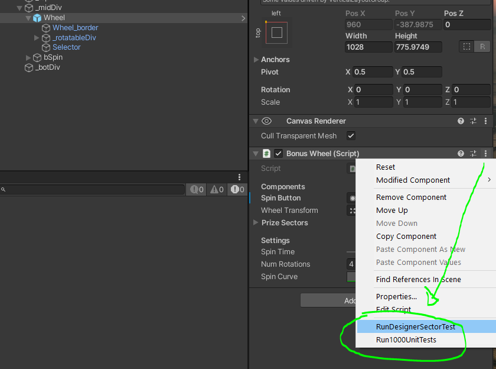
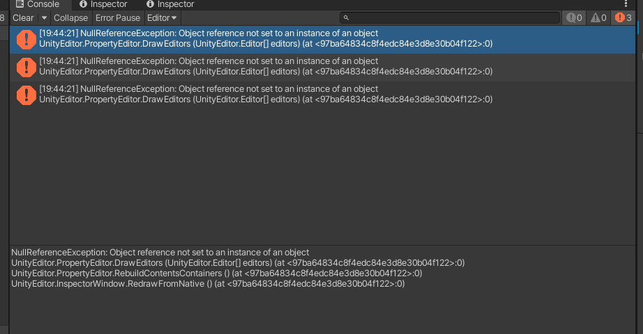

To run the unit tests, navigate to the BonusWheel.cs , click the 3 dots on the component, and run the methods

There are some odd editor errors being thrown in the console for some reason with this fresh install of LTS (2020.3.19).
Doesnt affect the actual project.

Could not build with  LTS (2020.3.19). There is a known error with android SDK on this version.
https://forum.unity.com/threads/setting-up-android-jdk-and-ndk-for-unity-2018-4-18f1-lts.838015/#post-5549776
https://forum.unity.com/threads/unable-to-detect-sdk-in-the-selected-directory.850387/

So I copied the project into a new 2019.4.0 LTS version (down grade did not work smoothly with package dependencies ) for the build requirement.
See BuildVideo.mp4 in assets

